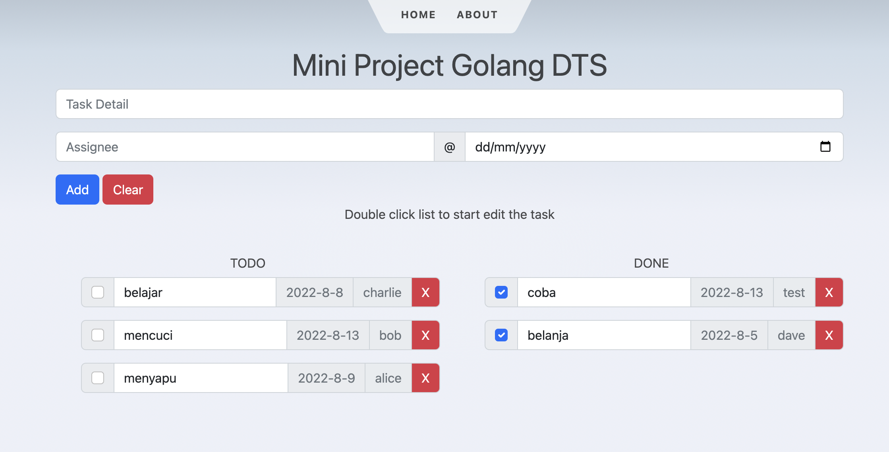

# Mini Project Golang DTS



## Demo

[https://wbso.up.railway.app/](https://wbso.up.railway.app/)

## App Structure

```
presentation layer (restapi package) --call-> app layer (app package) --call-> storage layer (store package)
```

## Run In Development Mode

1. copy `.env.example` to `.env`
2. Run Go Code

   ```sh
   make run
   ```

3. Run Frontend Code
   ```sh
   make run-frontend
   ```

## Deploy

### Deploy To Railway

1. Set `PORT` and `DATABASE_DSN` env variables in railway dashboard
2. Run `railway up`

### Deploy To General Server

1. Run `make build-frontend` to build frontend code
2. Run `make build` to build go code.
3. Upload go executable file and .env file to a directory on the server.
4. Execute the file on the server
